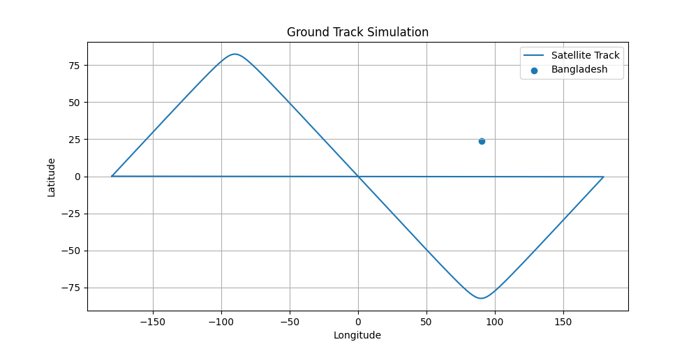

# Bangladesh Satellite Mission Simulation

Hi! I’m Anannya, and this is my first hands-on space mission simulation project.  

I’ve always dreamed of working with satellites, mission design, and space systems that have real-world impact. So I decided to start small by simulating a **satellite orbiting Earth** and analyzing **how often it would pass over Bangladesh**. This project is inspired by real-world satellite mission planning done by agencies like NASA and ESA.

---

## Objective

The goal of this project is to:

1. Simulate a **Low Earth Orbit (LEO) satellite**  
2. Calculate key orbital parameters (velocity, period, altitude)  
3. Visualize the satellite orbit around Earth  
4. Lay the foundation for **ground track analysis** to determine satellite passes over Bangladesh

---

## Methodology

- **Orbit Type:** Low Earth Orbit (LEO), circular  
- **Altitude:** 550 km above Earth  
- **Earth Radius:** 6371 km  
- **Orbit Radius (r):** 6921 km (Earth radius + altitude)  
- **Gravitational Parameter (μ):** 398600 km³/s²  

**Equations used:**

**1. Orbital Velocity:**  
\[
v = \sqrt{\frac{\mu}{r}}
\]

**2. Orbital Period:**  
\[
T = 2\pi \sqrt{\frac{r^3}{\mu}}
\]

---

## Results

**Calculated Values:**

| Parameter | Value |
|-----------|-------|
| Orbital Radius | 6921 km |
| Orbital Velocity | 7.59 km/s |
| Orbital Period | 95 minutes |
| Number of Orbits per Day | ~15 |

**Visualization:**  
The satellite orbit is circular around Earth. The following plot shows Earth (inner circle) and the satellite orbit (outer circle):

*(Note: This is the output from `orbit_plot.py`)*

**Interpretation:**  
- A satellite at 550 km altitude completes **~15 orbits per day**, giving multiple opportunities to pass over Bangladesh.  
- This confirms that a **LEO satellite can provide frequent coverage** for Earth observation applications such as flood monitoring, agriculture, or climate tracking.

---

## Tools Used

- **Python**: programming and calculations  
- **NumPy**: math operations  
- **Matplotlib**: visualizing the orbit  
- **Cartopy (future)**: for plotting ground tracks and mapping satellite passes

---

## Next Steps

1. **Ground Track Analysis:** Calculate when the satellite is over Bangladesh using latitude/longitude  
2. **Revisit Time Calculation:** How often the satellite can observe the country  
3. **Multiple Orbits & Constellation Simulation:** Extend to more than one satellite  
4. **Mission Optimization:** Test different altitudes and inclinations for best coverage  

These steps will make this simulation closer to **real mission planning tools**.

---

## Significance

This project represents me as a **future space scientist**:

- Passionate about aerospace and satellite systems  
- Able to combine coding, physics, and engineering  
- Starting to think like a mission analyst  
- Willing to take small steps toward bigger research  

Even at this small scale, this is **how space missions are designed: starting with calculations, simulating orbits, and visualizing coverage**.

---

*Let’s launch this tiny mission together, one orbit at a time.* 🚀
# Bangladesh Satellite Mission Simulation

Hi! I’m Anannya, and this is my first hands-on space mission simulation project.  

I’ve always dreamed of working with satellites, mission design, and space systems that have **real-world impact**. So I decided to start small by simulating a **satellite orbiting Earth** and analyzing **how often it would pass over Bangladesh**. This project is inspired by real-world satellite mission planning done by agencies like NASA and ESA.

---

## Objective

The goal of this project is to:

1. Simulate a **Low Earth Orbit (LEO) satellite**  
2. Calculate key orbital parameters (velocity, period, altitude)  
3. Visualize the satellite orbit around Earth  
4. Analyze **ground track** to determine satellite passes over Bangladesh

---

## Methodology

- **Orbit Type:** LEO, circular  
- **Altitude:** 550 km above Earth  
- **Earth Radius:** 6371 km  
- **Orbital Radius (r):** 6921 km  
- **Gravitational Parameter (μ):** 398600 km³/s²  
- **Orbit Inclination:** 97.6° (typical sun-synchronous orbit)

**Equations Used:**

**1. Orbital Velocity:**  
\[
v = \sqrt{\frac{\mu}{r}}
\]

**2. Orbital Period:**  
\[
T = 2\pi \sqrt{\frac{r^3}{\mu}}
\]

---

## Results

**Orbital Parameters:**

| Parameter | Value |
|-----------|-------|
| Orbital Radius | 6921 km |
| Orbital Velocity | 7.59 km/s |
| Orbital Period | 95 minutes |
| Orbits per Day | ~15 |

**Ground Track Analysis:**  
The satellite passes over Bangladesh approximately at the following times during one orbit:

These passes are calculated with ±2° latitude and longitude tolerance around Bangladesh’s center (23.685° N, 90.356° E).

**Visualizations:**  

- **Orbit Visualization:**  

- **Ground Track over Bangladesh:**  

**Interpretation:**  
- A LEO satellite completes ~15 orbits per day, providing multiple opportunities to pass over Bangladesh.  
- Ground track analysis shows **specific time windows** for observation.  
- This simulation demonstrates **how mission planners determine satellite coverage**, a fundamental step in Earth observation missions.

---

## Tools Used

- **Python**: programming and calculations  
- **NumPy**: numerical operations  
- **Matplotlib**: orbit and ground track visualization  
- **Cartopy (optional)**: enhanced mapping and geospatial plots

---

## Next Steps

1. Simulate **multiple orbits and days** to get full daily coverage  
2. Model **satellite constellations** for more frequent coverage  
3. Calculate **revisit times** and optimize orbit parameters  
4. Introduce **payload constraints** (camera resolution, swath width)

---

## Significance

This project represents me as a **future space scientist**:

- Passionate about aerospace and satellite systems  
- Able to combine coding, physics, and engineering  
- Thinking like a **mission analyst**  
- Willing to start small and grow into bigger, real-world space research

Even at this small scale, it mirrors **how real space missions are designed**: calculations → simulation → visualization → planning.

---

*Let’s launch this tiny mission together, one orbit at a time.* 🚀

